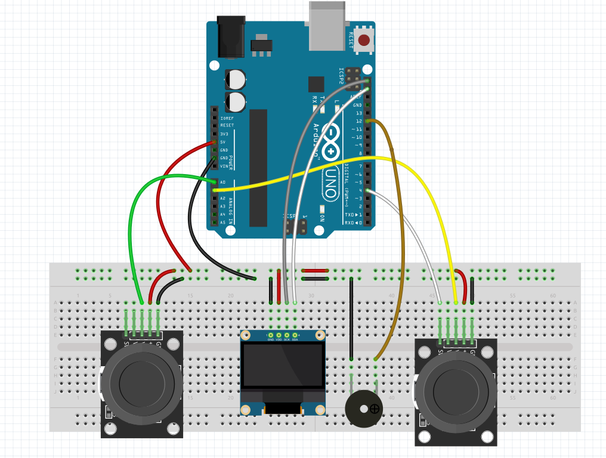

# 🎮 Pong Game for 2 Players (Arduino)

This is an Arduino-based two-player Pong game using an I²C OLED display, two analog joysticks, and a buzzer.  
It displays the game on a 128×64 OLED screen, keeps score, and provides sound feedback when the ball hits paddles or walls.  

Based on the project by Bruno Opaiva on [Arduino Project Hub](https://projecthub.arduino.cc/bruno_opaiva/pong-game-for-2-players-2e30f5).

---

## 📌 Overview

- **Objective**: Recreate the classic Pong game for two players on Arduino.  
- **Players control** paddles via analog joysticks.  
- **Visual output**: 128×64 I²C OLED display (SSD1306).  
- **Audio cues**: Buzzer beeps on paddle hits, wall bounces, and scoring events.  
- **Win condition**: First player to reach the max score (default: 8).  

---

## 🛠️ Hardware Requirements

| Component | Purpose |
|-----------|---------|
| Arduino Uno (or equivalent) | Host controller |
| I²C OLED Display (128×64) | Displays the Pong game |
| 2 × Analog Joysticks | Player paddle controls |
| Buzzer / Piezo | Audio feedback |
| Jumper wires | Connections |
| Breadboard | Prototyping setup |

---

## 💻 Software Requirements

- **Arduino IDE** (or PlatformIO)
- Libraries:
  - `Wire` (built-in, I²C communication)
  - `Adafruit_GFX`
  - `Adafruit_SSD1306`

---

## ⚡ Circuit Diagram

Below is the wiring diagram for the Pong Game setup:  

